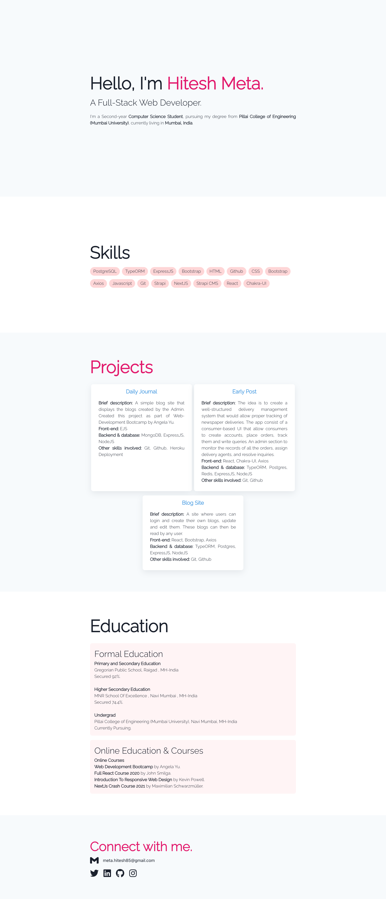

Portfolio Builder front-end using Nextjs and Chakra-UI.

1. Clone the repo and cd portfolio-builder-next-web 
3. Install all the packages using npm i
4. Setup .env file
5. Make sure the strapi-api server is running and you have filled the required columns
6. Run the server using npm run dev

